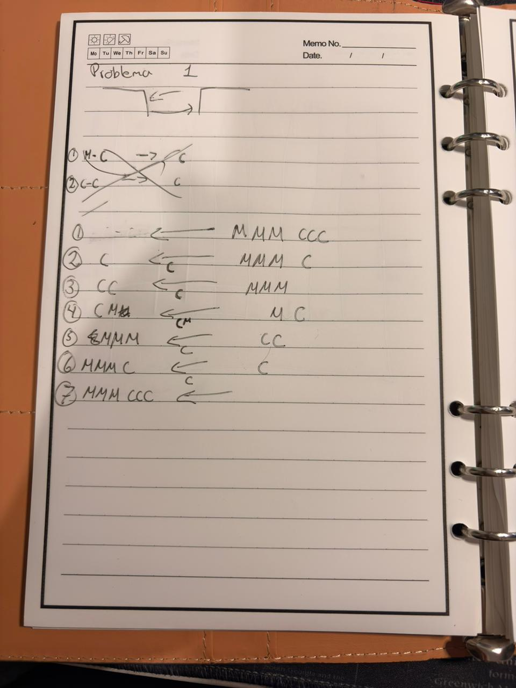
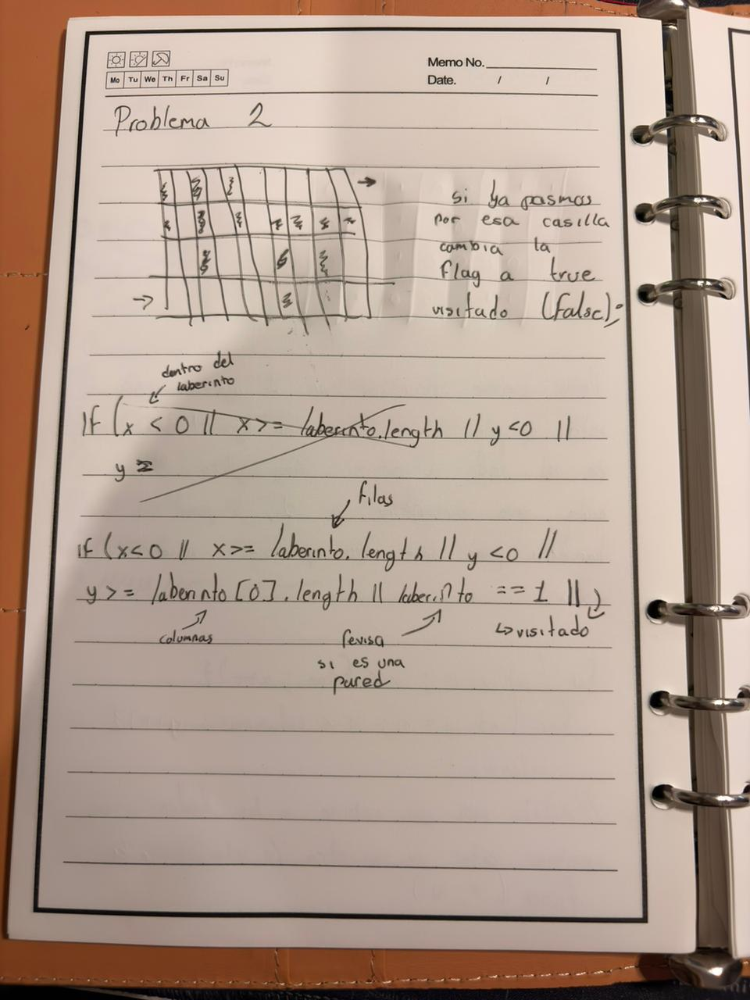
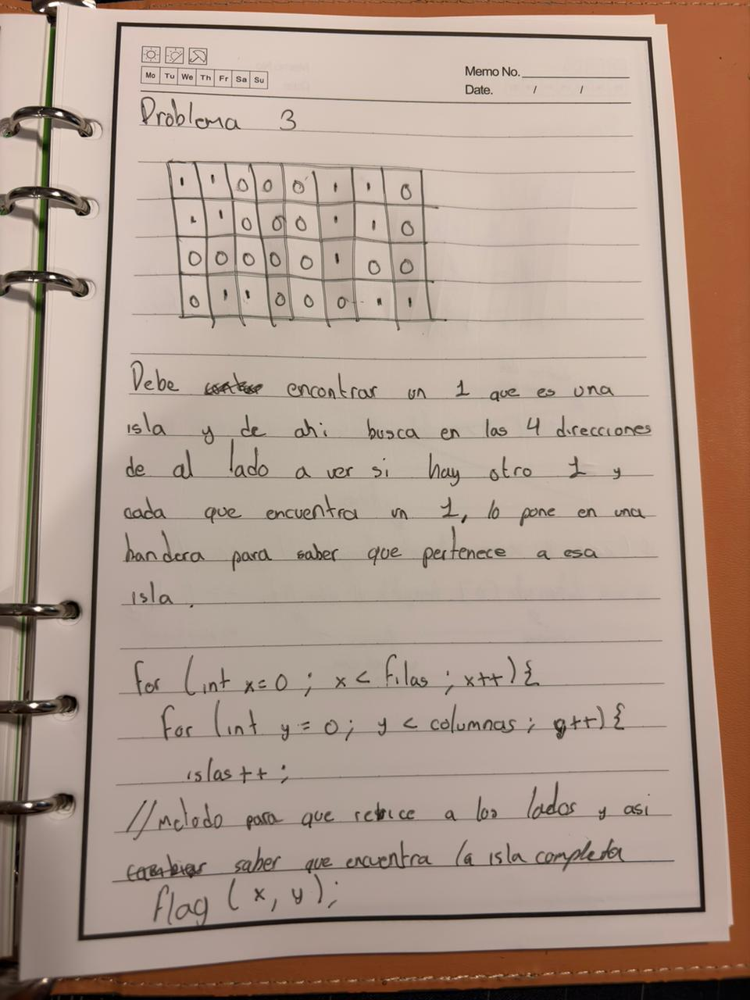

# Problemas - 27 de agosto

**Nombre:** Cesar Enrique Diaz Maldonado

---

## Problema 1.- 3 caníbales y 3 monjes

Pasar los 3 caníbales y los 3 monjes del otro lado del rio sin que haya
mas caníbales que monjes de un lado.

---

## Problema 2.- Resolver un laberinto no importan las dimensiones de este.

Lo que se debe hacer aquí es pararnos en un
punto de partida y verificar para todos los lados si no estamos fuera de
la matriz, la fila, la columna, revisamos si es una pared (1) y también
si ya lo visitamos ese, toda la matriz inicia con un valor de false y
cuando ya pasamos por ahí cambia a true y no volver a pasar por ahí.

---

## Problema 3.- Islas

