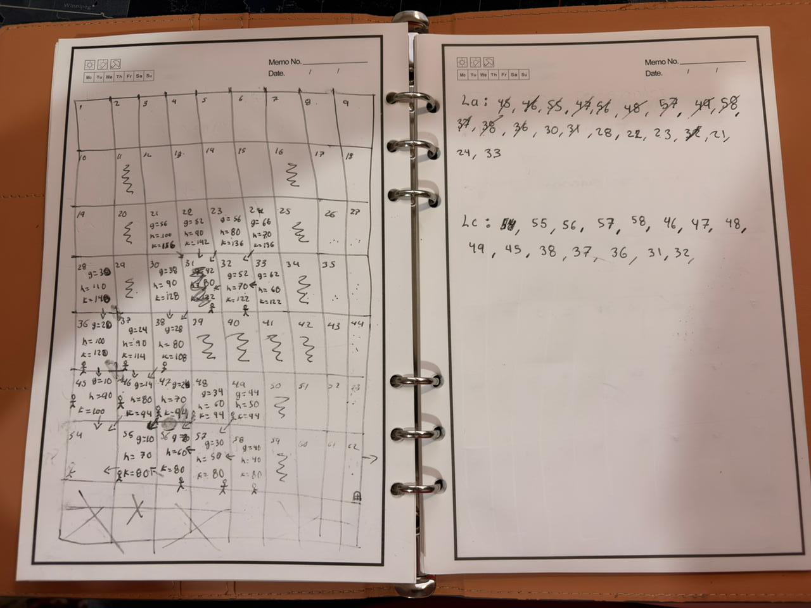

# Ejercicio de clase: Búsqueda A* sobre cuadrícula

> Nota: este ejercicio quedó **inconcluso**, es tal cual como avanzó durante la clase.

## ¿Qué se ve en la hoja?

Es una cuadrícula numerada (cada celda es un nodo del grafo/laberinto) sobre la que se está aplicando el algoritmo **A\***. Para cada celda que se explora se anotan tres valores:

- **g** → costo acumulado desde el nodo inicial hasta esa celda.
- **h** → valor heurístico, la estimación de distancia restante hasta la meta.
- **k** → el valor total usado para decidir qué celda explorar primero, es decir `f(n) = g(n) + h(n)`.

Las flechas entre celdas muestran de qué nodo "padre" viene cada expansión (el camino que se fue construyendo), y los muñequitos marcan las celdas por donde ya pasó el recorrido.

En la página de la derecha se llevan las dos listas clásicas del algoritmo:

- **La (Lista Abierta / Open List):** nodos ya descubiertos pero que faltan por explorar.
- **Lc (Lista Cerrada / Closed List):** nodos que ya fueron expandidos y revisados.

En resumen, la hoja es el registro manual de cómo A* va moviendo nodos de la lista abierta a la cerrada mientras calcula `f = g + h` en cada paso, buscando el camino de menor costo hacia la meta.
